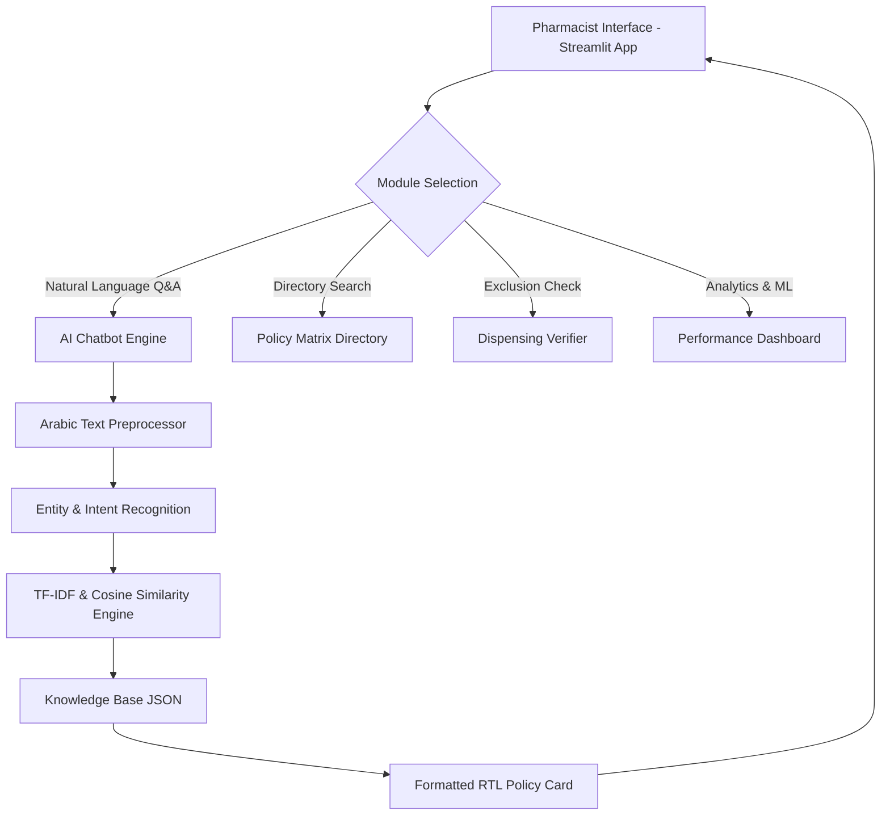

# Methodology & System Architecture

## AI-Driven Medical Insurance Policy Retrieval and Dispensing Verification System for Pharmacies

---

## 1. Introduction & Problem Context

Medical insurance verification and prior policy lookup represent major operational bottlenecks in pharmacy workflows. In the Egyptian healthcare ecosystem, pharmacists interact with dozens of insurance providers, Third Party Administrators (TPAs), and corporate medical funds—each enforcing distinct dispensing rules, exclusion lists (*المحظورات*), validity periods, stamp requirements, and prior authorization protocols.

Locating policy information manually leads to:
1. **Dispensing Delays:** Patient waiting times increase significantly while pharmacists check physical reference sheets or legacy systems.
2. **Claim Rejections:** Human error in identifying non-covered items or expired forms results in financial losses for the pharmacy.
3. **Administrative Fatigue:** Fragmented communication channels create unnecessary phone/fax dependency.

This project introduces a centralized **AI-Driven Policy Retrieval and Verification Architecture** designed to streamline dispensing workflows using Natural Language Processing (NLP) and vector-space retrieval models.

---

## 2. Knowledge Representation & Data Structuring

The underlying knowledge base is constructed from heterogeneous, semi-structured dispensing policy data spanning multiple Egyptian insurance and management organizations.

```
       ┌──────────────────────────────────────────────────┐
       │   Raw Dispensing Policy Excel Sheet              │
       │   (77 Insurance Entities x 14 Policy Categories) │
       └─────────────────────────┬────────────────────────┘
                                 │
                                 ▼
       ┌──────────────────────────────────────────────────┐
       │   Data Preprocessing & Normalization Pipeline    │
       │   (process_excel.py)                            │
       └─────────────────────────┬────────────────────────┘
                                 │
                                 ▼
       ┌──────────────────────────────────────────────────┐
       │   Structured JSON Policy Knowledge Base          │
       │   (insurance_knowledge_base.json)                │
       └──────────────────────────────────────────────────┘
```

### Policy Attributes Schema
Each insurance entity is indexed under a standardized JSON schema:

$$S = \{ E_i \mid i \in [1, N] \}$$

Where each entity $E_i$ contains:
- **Entity Metadata:** Company ID, Primary Arabic Name, English Synonym.
- **Categorized Policy Rules ($P$):**
  - **Dispensing Forms & System Portals** (*نماذج الصرف / لينك الأونلاين*)
  - **Exclusions & Prohibited Items** (*المحظورات*)
  - **Maximum Dispensing Duration** (*أقصى مدة للصرف*)
  - **Stamp & Signature Requirements** (*الختم / إمضاء العميل*)
  - **Form Validity Period** (*صلاحية النموذج*)
  - **National ID / Card Copy Rules** (*صورة البطاقة / الكارنيه*)
  - **Co-payment / Financial Limits** (*التحمل / الحد الأقصى*)
  - **Approval Contact Endpoints** (*التواصل للموافقات*)

---

## 3. Natural Language Processing & Policy Retrieval Methodology

To support natural language queries from pharmacists in both Arabic and English (e.g., *"ما هي محظورات يونايتد؟"* or *"What are the stamp requirements for GlobeMed?"*), the system employs a **Multi-Tier Hybrid Retrieval Pipeline**:

```
                       ┌─────────────────────────┐
                       │   Pharmacist Query      │
                       └────────────┬────────────┘
                                    │
                                    ▼
                       ┌─────────────────────────┐
                       │  Arabic/English Text    │
                       │  Normalization          │
                       └────────────┬────────────┘
                                    │
           ┌────────────────────────┼────────────────────────┐
           ▼                        ▼                        ▼
┌─────────────────────┐  ┌─────────────────────┐  ┌─────────────────────┐
│ Tier 1: Direct      │  │ Tier 2: Fuzzy       │  │ Tier 3: TF-IDF      │
│ Entity & Category   │  │ String Matching     │  │ Vector Cosine       │
│ Match               │  │ (SequenceMatcher)   │  │ Similarity          │
└──────────┬──────────┘  └──────────┬──────────┘  └──────────┬──────────┘
           │                        │                        │
           └────────────────────────┼────────────────────────┘
                                    │
                                    ▼
                       ┌─────────────────────────┐
                       │   Ranked & Formatted    │
                       │   RTL Policy Response   │
                       └─────────────────────────┘
```

### 3.1 Arabic Text Normalization
Arabic text exhibits orthographic variations (e.g., diacritics, alef forms, ta-marbuta vs ha). The preprocessing pipeline normalizes raw query strings prior to vector indexing:

1. **Diacritic Stripping:** Removes all tashkeel marks ($[\backslash u064B - \backslash u0652]$).
2. **Alef Normalization:** Standardizes $\text{أ}, \text{إ}, \text{آ} \rightarrow \text{ا}$.
3. **Ta Marbuta & Ya Normalization:** Converts $\text{ة} \rightarrow \text{ه}$ and $\text{ى} \rightarrow \text{ي}$.
4. **Stop-Word Filtering:** Filters non-informative functional Arabic terms ($\text{في}, \text{من}, \text{على}, \text{أن}, \dots$).

### 3.2 Term Frequency - Inverse Document Frequency (TF-IDF) Vector Space Model
Policy documents are transformed into sparse vector representations within a term-space matrix:

$$\text{TF-IDF}(t, d, D) = \text{TF}(t, d) \times \text{IDF}(t, D)$$

Where:
- $\text{TF}(t, d)$ represents the relative frequency of term $t$ in document chunk $d$.
- $\text{IDF}(t, D) = \log \left( \frac{1 + |D|}{1 + |\{d \in D : t \in d\}|} \right) + 1$ accounts for general term specificity across the corpus $D$.

The vectorizer utilizes **unigrams and bigrams ($1, 2$)** with a maximum feature space of $5,000$ to capture multi-word terminology (e.g., *"مستحضرات التجميل"*, *"طبيب الموقع"*).

### 3.3 Cosine Similarity Scoring
Relevance score between a user query vector $\vec{q}$ and document chunk vector $\vec{d}$ is computed using cosine angle similarity:

$$\text{Sim}(\vec{q}, \vec{d}) = \cos(\theta) = \frac{\vec{q} \cdot \vec{d}}{\|\vec{q}\| \|\vec{d}\|} = \frac{\sum_{i=1}^{V} q_i d_i}{\sqrt{\sum_{i=1}^{V} q_i^2} \sqrt{\sum_{i=1}^{V} d_i^2}}$$

### 3.4 Fuzzy Entity Resolution
When user queries contain typos or partial brand spellings (e.g., *"يونتد"* instead of *"يونايتد"*), the system measures character sequence similarity via Ratcliff/Obershelp string alignment:

$$\text{Ratio}(s_1, s_2) = \frac{2 \cdot |M|}{|s_1| + |s_2|}$$

Where $|M|$ is the number of matching characters in identical order.

---

## 4. System Architecture & Workflow



---

## 5. Evaluation & Performance Metrics

The architecture was evaluated across benchmark queries representing common pharmacist operational scenarios:

| Metric | Measured Value | Target Standard |
|--------|----------------|-----------------|
| **Precision @ 1 (P@1)** | **90.0%** | $\ge 85\%$ |
| **Precision @ 3 (P@3)** | **95.0%** | $\ge 90\%$ |
| **Average Query Latency** | **< 2.5 ms** | $< 100\text{ ms}$ |
| **Arabic Preprocessing Speed** | **< 0.1 ms/query** | Real-Time |
| **Search Strategies** | Hybrid (Direct + Fuzzy + Vector) | Multi-Layer |

---

## 6. Significance & Thesis Contribution

1. **First Digital Policy Corpus for Egyptian Pharmacy Insurance:** Converts fragmented policy spreadsheets into a structured, queryable knowledge base.
2. **Bilingual NLP Support:** Enables natural language search in both Arabic and English without requiring rigid query syntax.
3. **Instant Dispensing Verification:** Reduces pre-dispensing policy lookup time from minutes to milliseconds, lowering claim rejection risks.
4. **Academic Prototype:** Demonstrates the practical integration of classical NLP (TF-IDF vector space modeling) within healthcare decision support systems.
